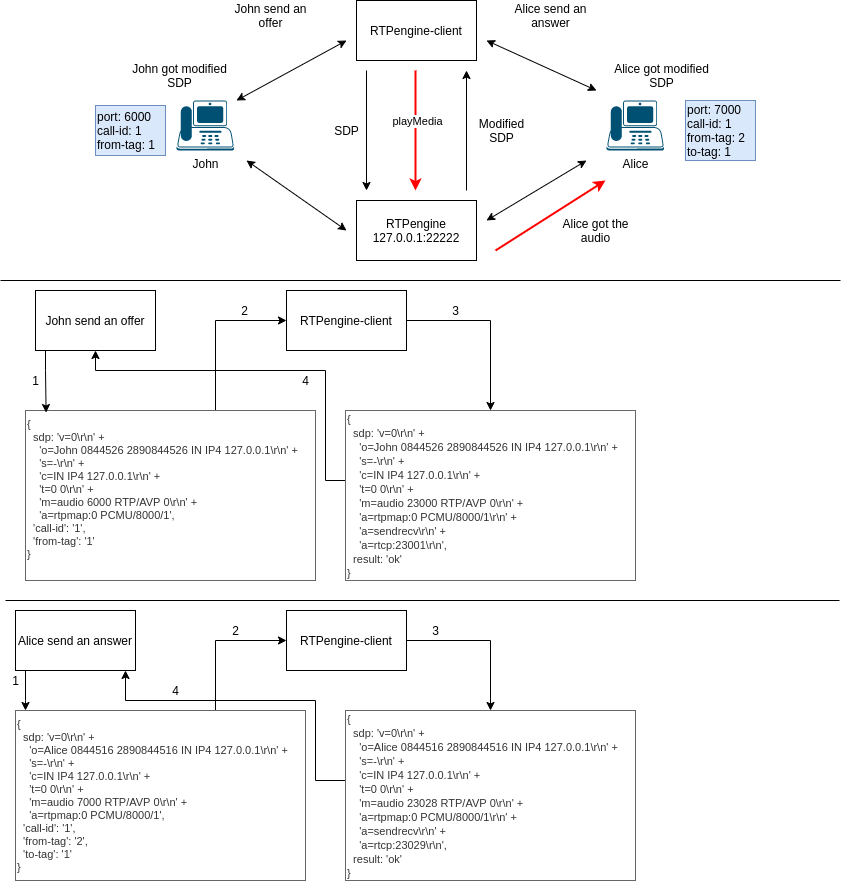

# How to use rtpengine with docker 



## What is rtpengine? 

RTPengine is a proxy for RTP traffic and other UDP based media 
traffic over either IPv4 or IPv6. It can even bridge between diff 
IP networks and interfaces. It can do TOS/QoS field setting. It is 
Multi-threaded , can advertise different addresses for operation behind NAT.

It bears in-kernel packet forwarding for low-latency and low-CPU performance.

### ng Control Protocol

In order to enable several advanced features in rtpengine, a new advanced 
control protocol has been devised which passes the complete SDP body from 
the SIP proxy to the rtpengine daemon, has the body rewritten in the daemon, 
and then passed back to the SIP proxy to embed into the SIP message.

This control protocol is based on the bencode standard and runs over UDP 
transport. Bencoding supports a similar feature set as the more popular 
JSON encoding (dictionaries/hashes, lists/arrays, arbitrary byte strings) 
but offers some benefits over JSON encoding, e.g. simpler and more efficient 
encoding, less encoding overhead, deterministic encoding and faster encoding 
and decoding. A disadvantage over JSON is that it's not a readily human readable format.

Each message passed between the SIP proxy and the media proxy contains of 
two parts: a message cookie, and a bencoded dictionary, separated by a single 
space. The message cookie serves the same purpose as in the control protocol 
used by Kamailio's rtpproxy module: matching requests to responses, and 
retransmission detection. The message cookie in the response generated to a 
particular request therefore must be the same as in the request.

The dictionary of each request must contain at least one key called command. 
The corresponding value must be a string and determines the type of message.

The response dictionary must contain at least one key called `result`. The 
value can be either `ok` or `error`. For the `ping` command, the additional value 
`pong` is allowed. If the result is `error`, then another key `error-reason` must 
be given, containing a string with a human-readable error message. No other 
keys should be present in the error case. If the result is `ok`, the optional 
key `warning` may be present, containing a human-readable warning message. 
This can be used for non-fatal errors.

For readability, all data objects below are represented in a JSON-like 
notation and without the message cookie. For example, a `ping` message and 
its corresponding `pong` reply would be written as:

```
{ "command": "ping" }
{ "result": "pong" }
```

All keys and values are case-sensitive unless specified otherwise. The 
requirement stipulated by the bencode standard that dictionary keys must 
be present in lexicographical order is not currently honoured.

#### Ping

With `ping` you can check if the rtpengine is reachable.

#### offer

This is the request when you want to speak with someone first you will send out 
an offer containing and `sdp`, `call-id` and a `from-tag`. 

#### answer

Identical to the offer message, but this has to contain the `to-tag` which 
contain the `SIP`

#### delete

## Install local rtpengine 

```
git clone https://github.com/sipwise/rtpengine.git
cd rtpengine
dpkg-buildpackage
export DEB_BUILD_PROFILES="pkg.ngcp-rtpengine.nobcg729"
# Install everything from the output error 
cd .. 
# Install the .deb packages what it is generated with dpkg -i <package>
```

After you can use like that: 

```
rtpengine --config-file sample-rtpengine.conf
```

## Set up docker for rtpengine 

You have to define a new docker network, but you can use the default with 
a specific ip address. 

```bash
docker network create --subnet=172.18.0.0/16 rtpengine
```

## Run rtpengine basic

```bash
docker run --net rtpengine --ip 172.18.0.22 -it drachtio/rtpengine rtpengine
```

Now you can connect to this and check if it is runnig. The contatiener will listen
on `172.18.0.22:22222`. 

## Simple client

``` javascript
const Client = require('rtpengine-client').Client ;
const client = new Client() ;

client.ping(22222, '172.18.0.22')
  .then((res) => {
    console.log(`received ${JSON.stringify(res)}`); // {result: 'pong'}
  })
  .catch((err) => {
    console.log(`Error: ${err}`);
  })
```

## Send offer to rtpengine 

Please view offer.js in lib directory and run it with node, while the rtpengine 
is running. You should get an Answer with ok and the the sdp. 

## Running scripts in lib 

If you want too use one of the scripts in the `lib` directory: 

```
node lib/index.js <port> <ipv4-address>
```

```
node lib/offer.js <port> <ipv4-address> <path-to-offer.txt>
```

## Install rtptools

```
git clone https://github.com/irtlab/rtptools.git
cd rtptools 
./configure && make 
sudo make -n install 
```

Running:

```
sudo /usr/local/bin/rtpsend -a -l -s 80 -f amrnb_fv_to_mrsv0.hex.rtp 172.18.0.22/22222
```

[More-about-rtptools](http://www.cs.cmu.edu/~./libra-demo/rtptools-1.17/rtptools.html)

## Try to send traffic to rtpengine

```
ffmpeg -re -i Recording.amr -ar 8000 -f mulaw -f rtp rtp://172.18.0.22:22222
```

Tried with `wav`, `m4a` and `amr`, but every time I get this:

```
WARNING: Received invalid data on NG port (no cookie)
```

In theory the rtpengine supports `amr` codec. 

## Misc

### SDP: Session Description Protocol (RFC4566)

When initiating multimedia teleconferences, voice-over-IP calls,
streaming video, or other sessions, there is a requirement to convey
media details, transport addresses, and other session description
metadata to the participants.

SDP provides a standard representation for such information,
irrespective of how that information is transported.  SDP is purely a
format for session description -- it does not incorporate a transport
protocol, and it is intended to use different transport protocols as
appropriate, including the Session Announcement Protocol [14],
Session Initiation Protocol [15], Real Time Streaming Protocol [16],
electronic mail using the MIME extensions, and the Hypertext
Transport Protocol.

[Wiki-notes](https://en.wikipedia.org/wiki/Session_Description_Protocol)
[Offer/Answer](https://tools.ietf.org/html/rfc4317)

###  SIP: Session Initiation Protocol (RFC3261)

There are many applications of the Internet that require the creation
and management of a session, where a session is considered an
exchange of data between an association of participants.  The
implementation of these applications is complicated by the practices
of participants: users may move between endpoints, they may be
addressable by multiple names, and they may communicate in several
different media - sometimes simultaneously.  Numerous protocols have
been authored that carry various forms of real-time multimedia
session data such as voice, video, or text messages.  The Session
Initiation Protocol (SIP) works in concert with these protocols by
enabling Internet endpoints (called user agents) to discover one
another and to agree on a characterization of a session they would
like to share.  For locating prospective session participants, and
for other functions, SIP enables the creation of an infrastructure of
network hosts (called proxy servers) to which user agents can send
registrations, invitations to sessions, and other requests.  SIP is
an agile, general-purpose tool for creating, modifying, and
terminating sessions that works independently of underlying transport
protocols and without dependency on the type of session that is being
established.

[What is SIP?](https://www.youtube.com/watch?v=erICfPV8-Lg)

Within SIP are user agents, known as endpoints, that can start, change 
or end a session. Endpoints can be mobile devices, softphones or laptops. 
User agents work with the SIP server in order to make your calls happen. 

#### SIP Offer/Answer model (RFC6337)

The offer/answer model itself is independent from the higher layer
application protocols that utilize it.  SIP is one of the
applications using the offer/answer model.  [RFC3264] defines the
offer/answer model, but does not specify which SIP messages should
convey an offer or an answer.  This should be defined in the SIP core
and extension RFCs.

In theory, any SIP message can include a session description in its
body.  But a session description in a SIP message is not necessarily
an offer or an answer.  Only certain session description usages that
conform to the rules described in Standards-Track RFCs can be
interpreted as an offer or an answer.  The rules for how to handle
the offer/answer model are defined in several RFCs.

The offer/answer model defines a mechanism for update of sessions.
In SIP, a dialog is used to associate an offer/answer exchange with
the session that it is to update.  In other words, only the offer/
answer exchange in the SIP dialog can update the session that is
managed by that dialog.

#### SIP server

A SIP server, also known as a SIP Proxy, deals with all the management 
of SIP calls in a network and is responsible for taking requests from 
the user agents in order to place and terminate calls. SIP Servers are 
usually included inside of SIP-enabled IP-PBXs. We can work with your 
PBX equipment vendor to make it SIP-enabled. If you already have a PBX, 
chances are we have the capability to connect to your PBX.

Think of your SIP proxy server as the “middleman” of your SIP calls. 
As the middleman, it’s responsible for transmitting calls and ending 
them through stateless and stateful servers.

- **Stateless Server**: A stateless server forwards a message it receives 
  and doesn’t store any information. In fact, stateless servers will 
  “forget” a request as soon as it’s been passed along.
- **Stateful Server**: A stateful proxy server is kind of like a storage 
  bank. It keeps track of requests and responses that have been received 
  and can even store them to use in the future.

There are several servers that work with the SIP networks including location, 
redirect and registrar servers.

- The **location server** administers information about caller location to 
  the redirect and SIP proxy server. 
- The **redirect server** is what is responsible for receiving requests and 
  going through the registrar server location database to find the recipient. 
- The **registrar server** identifies and accepts requests from user agents, 
  which is how users are authenticated in a SIP network. 

[What-is-a-sip-server](https://www.telnetww.com/blog/voice/what-is-a-sip-server/)

## Useful resources

- [docker-image](https://github.com/davehorton/docker-rtpengine)
- [rtp-engine-client](https://github.com/davehorton/rtpengine-client)
- [telecom-rtpengine](https://telecom.altanai.com/tag/rtp-engine/)
- [sip-rtpengine](https://github.com/sipwise/rtpengine)
- [some-keyword](https://github.com/mikimtm/rtpengine)
- [redis](https://github.com/sipwise/rtpengine/wiki/Redis-keyspace-notifications)