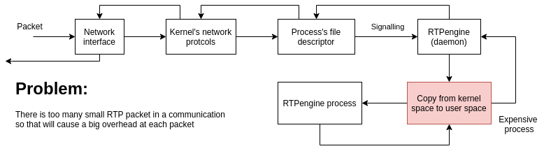
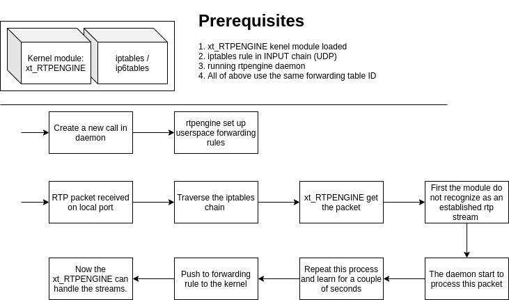

# Iptables

## Brief intro 

### In-Kernel Packet Forwarding

In normal userspace-only operation, the overhead involved in processing each 
individual RTP or media packet is quite significant. This comes from the fact 
that each time a packet is received on a network interface, the packet must first 
traverse the stack of the kernel's network protocols, down to locating a process's 
file descriptor. At this point the linked user process (the daemon) has to be 
signalled that a new packet is available to be read, the process has to be 
scheduled to run, once running the process must read the packet, which means it 
must be copied from kernel space to user space, involving an expensive context 
switch. Once the packet has been processed by the daemon, it must be sent out 
again, reversing the whole process.

<p align="center">
    
</p>

All this wouldn't be a big deal if it wasn't for the fact that RTP traffic generally 
consists of many small packets being transferred at high rates. Since the forwarding 
overhead is incurred on a per-packet basis, the ratio of useful data processed to 
overhead drops dramatically.

For these reasons, rtpengine provides a kernel module to offload the bulk of the packet 
forwarding duties from user space to kernel space. Using this technique, a large 
percentage of the overhead can be eliminated, CPU usage greatly reduced and the 
number of concurrent calls possible to be handled increased.

To avoid the overhead involved in processing each individual RTP packet in 
userspace-only operation, especially as RTP traffic consists of many small 
packets at high rates, rtpengine provides a kernel module to offload the bulk 
of the packet forwarding duties from user space to kernel space. This also 
results in increasing the number of concurrent calls as CPU usage decreases.
In-kernel packet forwarding is implemented as an iptables module (`x_tables`) 
and has 2 parts – `xt_RTPENGINE` and plugin to the iptables and ip6tables 
command-line utilities.

<p align="center">
  
</p>

#### Kernel Module

The kernel module supports multiple forwarding tables (not to be confused 
with the tables managed by iptables), which are identified through their ID 
number. By default, up to 64 forwarding tables can be created and used, giving 
them the ID numbers 0 through 63.

Each forwarding table can be thought of a separate proxy instance. Each running 
instance of the rtpengine daemon controls one such table, and each table can 
only be controlled by one running instance of the daemon at any given time. 
In the most common setup, there will be only a single instance of the daemon 
running and there will be only a single forwarding table in use, with ID zero.

The kernel module can be loaded with the command modprobe `xt_RTPENGINE`.
After loading the kernel module two file will generated in `/proc/rpteingine/`
folder: 

- `control`: Write-only and is used to create and delete forwarding tables. 
    And support two command: 
    - `add`: Add a forwarding table with a specific ID: `echo 'add 42' > /proc/rtpengine/control`
    - `del`: Remove a forwarding table with a specific ID: `echo 'del 42' > /proc/rtpengine/control`
- `list`: Read-only and will produce a list of currently active forwarding tables

If a forwarding table is active the rtpengine will generate a subfolder with 
the table ID: `/proc/rtpengine/$ID/`. There will be 4 files in this folder:

- `blist`: Contain the forwarding rules with their stats, etc. in binary form.
- `control`: The rtpengine will keep it open and issue updates to forwarding rules.  
- `list`: The same as *blist* only difference it is readable by human.  
- `status`: Short stats output for the forwarding table. 

Manual creation of forwarding tables is normally not required as the daemon 
will do so itself, however deletion of tables may be required after shutdown 
of the daemon or before a restart to ensure that the daemon can create 
the table it wants to use.

The kernel module can be unloaded through `rmmod xt_RTPENGINE`, however this 
only works if no forwarding table currently exists and no iptables rule 
currently exists.

#### iptables module 

In order for the kernel module to be able to actually forward packets, an 
iptables rule must be set up to send packets into the module. Each such 
rule is associated with one forwarding table. In the simplest case, for 
forwarding table 42, this can be done through:

```
iptables -I INPUT -p udp -j RTPENGINE --id 42
```

- **-I**: Insert one or more rules in the selected chain as the given rule 
    number. So, if the rule number is 1, the rule or rules are inserted at 
    the head of the chain. This is also the default if no rule number is specified.
- **-p**: The protocol of the rule or of the packet to check. The specified 
    protocol can be one of tcp, udp, icmp, or all, or it can be a numeric 
    value, representing one of these protocols or a different one.
- **-j**: This specifies the target of the rule; i.e., what to do if the 
    packet matches it. The target can be a user-defined chain (other than 
    the one this rule is in), one of the special builtin targets which decide 
    the fate of the packet immediately, or an extension.
- **--id**: Table id. 

It is possible but not strictly necessary to restrict the rules to the UDP 
port range used by rtpengine, e.g. by supplying a parameter like 
`--dport 30000:40000`. If the kernel module receives a packet that it doesn't 
recognize as belonging to an active media stream, it will simply ignore it 
and hand it back to the network stack for normal processing.

The `RTPENGINE` rule need not necessarily be present directly in the `INPUT` 
chain. It can also be in a user-defined chain which is then referenced 
by the `INPUT` chain, like so:

```
iptables -N rtpengine
iptables -I INPUT -p udp -j rtpengine
iptables -I rtpengine -j RTPENGINE --id 42
```

This can be a useful setup if certain firewall scripts are being used.

## Testing with iptables 

It should be noted that each time the computer restarts, the iptables 
command must be issued, otherwise it will not work properly.

First enable the kernel module with the following command: 

```
modprobe xt_RTPENGINE
```

Next create the proper iptables rules. This will create a new rule 
in the `INPUT` chain for UDP packets with table ID 42.  

```
sudo iptables -I INPUT -p udp -j RTPENGINE --id 42 
```

Start the rtpengine to use this table. 

```
sudo rtpengine --table=42 --interface=127.0.0.1 --listen-ng=127.0.0.1:22222 --pidfile=/run/rtpengine.pid --no-fallback --foreground=true  --log-level=6 --log-stderr=true
```

- `--table`: Kernel table to use. 
- `--interface`: Local interface for RTP.
- `--listen-ng`: UDP port to listen on NG protocol. 
- `--pidfile`: Write PID to file. 
- `--no-fallback`: Only start when kernel-module is available. 
- `--foreground`: Don't fork to background. 
- `--log-level`: Log level. 
- `--log-stderr`: Log on stderr instead of syslog. 

Test if everything runs fine: 

1. This command will print out the process pid number: `cat /run/rtpengine.pid`. 
2. Check if the /proc/rtpengine/42/ folder is created with the files: `ls /proc/rtpengine/42`

If all of this generated you can continue. 

Start listening UDP traffic on localhost to see if everything is alright.

```
sudo tcpdump -i lo udp -vvn -w traffic.pcap 
```

Generate traffic with the python script. If you don't have `ffmpeg` please install and 
any pip package what the python code is needed. Navigate to the root of this repo. 

```
python clients/python/app.py -gc 300 -af audios/recording.wav
```

- **-gc**: Generate 300 different call and start transfer an audio stream between clients.
- **-af**: Location of the audio file. 

Please be aware that kind of load with ffmpeg could freeze your computer. 

If the script is running pleas check the `list` and `status` under the 
`/proc/rtpengine/42` folder. The `status` file should contain 600 targets 
and the `list` files should describe the calls like this: 

```
...
local inet4 127.0.0.1:30018
       src inet4 127.0.0.1:30000
       dst inet4 127.0.0.1:3002
    stats:               144004 bytes,                  139 packets,                    0 errors
        RTP payload type   0:               144004 bytes,                  139 packets
  SSRC in: debf3b42
...
```

## Summary 

In the pcap file I cannot see any difference in latency or jitter. But in CPU load I 
there is the difference. In simple user-space mode the rtpengine at 300 calls 
produce around 20% of load while with kernel module the kernel load is only around 
8-10%. I cannot test with larger load due to ffmpeg memory usage. But I think and 
the documentation said with kernel-module you can achieve more parallel call on the 
same machine. That could help us in Kubernetes environment to scale up and down the 
application fewer times. 