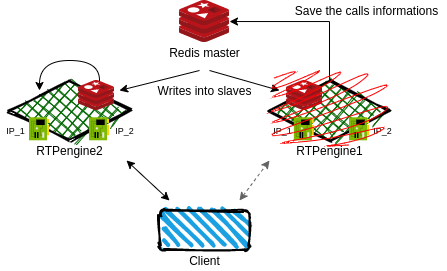
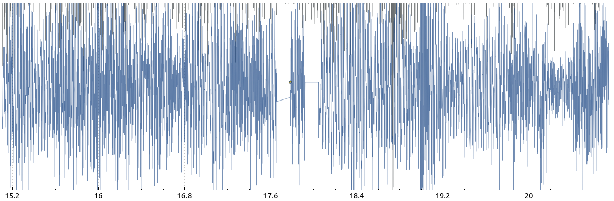

# Redis

The Redis keyspace notifications can be used as a mean to synchronize session 
information among different rtpengine instances. This is especially useful if 
one needs to realize a redundant media relay setup. In such a setup, rtpengine 
machines can be configured to act, at the same time, both as:

- **active** machine 
  - create calls via offer()/answer(), counted as OWN calls.
  - destroy calls 
- **passive** (backup) machine
  - create new calls via SADD notifications, counted as FOREIGN calls.
  - destroy calls 

rtpengine will always differentiate between:

- **OWN** calls: 
  - created via offer()/answer()
  - destroyed, by delete() 
- **FOREIGN** calls: 
  - created via SADD notification
  - destroyed DEL, FINAL_TIMEOUT or cli

## Redis config

To configure Redis you have to edit the `rtpengine.conf` file which will 
contain specifications to rtpengine. For example if you want three rtpengine 
instance, you have to write something like this to their config file. 

**rtpengine1**

```
interface=pub1/10.255.255.101;pub2/10.255.255.102;pub3/10.255.255.103
redis=10.255.1.200:6379/1
subscribe-keyspace=2;3
```

**rtpengine2**

```
interface=pub2/10.255.255.102;pub3/10.255.255.103;pub1/10.255.255.101
redis=10.255.1.200:6379/2
subscribe-keyspace=3;1
```

**rtpengine3**

```
interface=pub3/10.255.255.103;pub1/10.255.255.101;pub2/10.255.255.102
redis=10.255.1.200:6379/3
subscribe-keyspace=1;2
```

- **interface**:
  - Specifies a local network interface for RTP. At least one must be given, but multiple 
  can be specified. The format of the value is `[NAME/]IP[!IP]` with `IP` being either an 
  IPv4 address or an IPv6 address.
  - The second IP address after the exclamation point is optional and can be used if the 
  address to advertise in outgoing SDP bodies should be different from the actual local 
  address. This can be useful in certain cases, such as your SIP proxy being behind NAT. 
  For example, `--interface=10.65.76.2!192.0.2.4` means that 10.65.76.2 is the actual local 
  address on the server, but outgoing SDP bodies should advertise 192.0.2.4 as the 
  address that endpoints should talk to. Note that you may have to escape the exlamation 
  point from your shell, e.g. using `\!`.
- **redis**:
  - Connect to specified Redis database (with the given database number) and use it for 
  persistence storage. The format of this option is `ADDRESS:PORT/DBNUM`, for example 
  `127.0.0.1:6379/12` to connect to the Redis DB number 12 running on localhost on the 
  default Redis port.
  - If the Redis database is protected with an authentication password, the password can 
  be supplied by prefixing the argument value with the password, separated by an `@` symbol, 
  for example `foobar@127.0.0.1:6379/12`. Note that this leaves the password visible in the 
  process list, posing a security risk if untrusted users access the same system. As an 
  alternative, the password can also be supplied in the shell environment through the 
  environment variable `RTPENGINE_REDIS_AUTH_PW`.
  - On startup, rtpengine will read the contents of this database and restore all calls 
  stored therein. During runtime operation, rtpengine will continually update the database's 
  contents to keep it current, so that in case of a service disruption, the last state 
  can be restored upon a restart.
  - When this option is given, rtpengine will delay startup until the Redis database adopts 
  the master role (but see below).
- **subscribe-keyspace**:
  - List of redis keyspaces to subscribe. If this is not present, no keyspaces are subscribed 
  (default behaviour).

The "pub" prefixes are essential for this concept to work.

The first "pub/IP" in the interface list is used to bind **OWN** calls (calls created via 
offer()/answer()). The next "pub/IP" in the interface list are used to bind **FOREIGN** calls 
(calls created via redis notifications), for redundancy.

To make sure the configuration for the redundancy concept is in place, suppose one OWN call 
comes to each of the rtpengine1/2/3. Upon `rtpengine-ctl list numsessions`, one should get the 
following output on all rtpengine1/2/3:

```
Current sessions own: 1
Current sessions foreign: 2
Current sessions total: 3
```

## Test

<p align="center">
  
</p>

### Scenario

1. The client create an RTP session on **RTPengine1** with active **IP_1**.
2. Traffic arrives to RTPengine1 and save session information in **Redis master, keyspace 1**.
3. Redis master replicates information to Redis slaves. 
4. On RTPengine2 the Redis slave will notify the RTPengine2 about the call and it will create 
  a new session based on the given call information on **IP_1**.
5. Somehow the RTPengien1 is crash. 
6. Traffic routed via alternative route through RTPengine2. 

### Localhost
#### Redis 

Start the redis server: 

```
redis-server
```

And now set up the keyspace notification event and check every keyspace and keyevent events: 

```
redis-cli config set notify-keyspace-events KEA
redis-cli --csv psubscribe '__key*__:*'
```

Where the `KEA` stands for: 

- **K**: Notify on *Keyspace* events.
- **E**: Notify on *Keyevents* events.
- **A**: Alias for every other commands except when the keyspace is missing. 

#### Rtpengines 

The first one: 

```
sudo rtpengine --interface=pub1/127.0.0.2 --interface=pub2/127.0.0.3 --redis=127.0.0.1:6379/1 \
--subscribe-keyspace=2 --foreground=true --log-stderr=true --listen-ng=127.0.0.2:22222 --log-level=6 \
--delete-delay=0 --timeout=600 --port-min=23000 --port-max=30000
```

The second one:

```
sudo rtpengine --interface=pub2/127.0.0.3 --interface=pub1/127.0.0.2 --redis=127.0.0.1:6379/2 \
--subscribe-keyspace=1 --foreground=true --log-stderr=true --listen-ng=127.0.0.3:22222 --log-level=6 \
--delete-delay=0 --timeout=600 --port-min=23000 --port-max=30000
```

#### Generate traffic

Generate traffic with the python client: 

```
python python/app.py -af python/recording1h.wav -gc 1 -addr 127.0.0.2 -p 22222 
```

This generate a call with offer and answer and after it start streaming a bidirectional one hour
PCM audio file. 

#### Tests 

Details:
- Caller address: `127.0.0.1:3002`
- Callee address: `127.0.0.1:3004`
- Caller RTPengine address: `127.0.0.2:23000`
- Callee RTPengine address: `127.0.0.2:23010`

Used tcpdump command: `sudo tcpdump -i lo udp -vvn -w traffic.pcap`

Changes in audio: 

<p align="center">
  
</p>

As you can see there is two gap in the `23000-3002` stream. The first one start from 17.65s to 17.83s
and the second one start from 17.9s to 18.05s. So this gap in summary is around 0.33s which is not 
too much.

The jitter and the delay is almost the same as in a normal situation. 

### Docker

First make a redis db.

```
docker run --net rtpengine --ip 172.18.0.30 -v /redis/redis.conf:/usr/local/etc/redis/redis.conf --name redis redis redis-server /usr/local/etc/redis/redis.conf
```

The redis database is running with `notify-keyspace-events KEA`. 

Tun an rtpengine instance with this configuration: 

```
[rtpengine]
interface=pub1/127.0.0.1;pub2/127.0.0.2
redis=172.18.0.30:6379/1
subscribe-keyspace=2

foreground=true
log-stderr=true
listen-ng=127.0.0.1:22222
port-min=23000
port-max=32768
recording-dir=/tmp
recording-method=pcap
recording-format=eth
log-level=6
delete-delay=0
timeout=600
```

Initialize a call with the python client: 

```
python clients/python/app.py -o sdps/perl/caller.json -a sdps/perl/callee.json
```

List the active calls: 

```
$ python clients/python/app.py -f sdps/list.json
{'calls': ['0.5423403855684267'], 'result': 'ok'}
```

Now fire up the the second rtpengine instance with this config: 

```
[rtpengine]
interface=pub2/127.0.0.2;pub1/127.0.0.1
redis=172.18.0.30:6379/2
subscribe-keyspace=1

foreground=true
log-stderr=true
listen-ng=127.0.0.1:22222
port-min=23000
port-max=32768
recording-dir=/tmp
recording-method=pcap
recording-format=eth
log-level=6
delete-delay=0
timeout=600
```

Close the other rtpengine instance and list the calls again. You should 
see same as before. 

It also works during a normal call, but there may be a small turnaround 
time while the new instance can handle the call. The associated ffmpeg 
instructions can be found here. But in addition, the folder also contains 
a pcap, in which you can see such a change after about 500 packets.

```
sudo ffmpeg -re -i audios/recording.wav -ar 8000 -ac 1 -acodec pcm_mulaw -f rtp 'rtp://127.0.0.1:23000?localrtpport=2000'

sudo ffmpeg -re -i audios/recording.wav -ar 8000 -ac 1 -acodec pcm_mulaw -f rtp 'rtp://127.0.0.1:23018?localrtpport=2004'
```