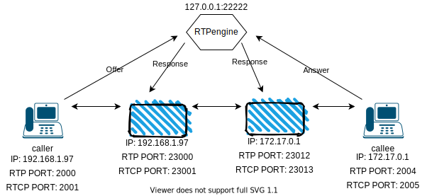
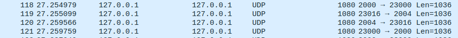

# Make a call

Please navigate to the project root directory and follow the 
instructions below. 

## Setup RTPengine 

Just run the command below, and this will start an rtpengine instance 
which listen on `127.0.0.1:22222`. So the node.js client should 
connect to this address. 

```
sudo rtpengine --config-file sample-rtpengine.conf
```

## Clients (Offer/Answer)

First you have to make an **offer** to register a caller client in 
**rtpengine**. For this please run the code below to receive the 
modified **SDP** which will needed to simulate a call. And you should 
search for a port number between `23000-32768`. 

```
node lib/offer.js 22222 127.0.0.1 sdps/perl/caller.json
```

Please see the **caller.json** [here](../sdps/perl/caller.json)

If write down the port e.g. **23000** you have to make an answer 
from the callee to make a **dialog** between them. 

```
node lib/answer.js 22222 127.0.0.1 sdps/perl/callee.json
```

Please see the **callee.json** [here](../sdps/perl/caller.json)

Write down that port too e.g. **23012**.

Now terminate the calls, beacouse you have to send traffic from port 
**2000** and **2004** which currently used. So free them up. 

This proccess will look like something like this: 



## Run TCPdump

To examine the result you should run the `tcpdump` tool just like 
below. This command will creata file named `traffic.pcap` which 
contains the rtp packets. 

```
sudo tcpdump -i any udp -vvn -w traffic.pcap
```

## Generate traffic

To generate traffic I used `ffmpeg`, but if you want to use other tool 
you can. 

Generate traffic from **caller**:

```
sudo ffmpeg -re -i audios/recording.wav -ar 8000 -ac 1 -acodec pcm_mulaw -f rtp 'rtp://127.0.0.1:23000?localrtpport=2000'
```

What does this line do? Basicly send a PCMU rtp stream from caller to callee.

Parts of the command: 

- `-re -i`: Read input at native frame rate. Mainly used to simulate a grab device, or live 
  input stream (e.g. when reading from a file). Should not be used with actual grab 
  devices or live input streams (where it can cause packet loss). By default ffmpeg attempts 
  to read the input(s) as fast as possible. This option will slow down the reading of the 
  input(s) to the native frame rate of the input(s). It is useful for real-time output 
  (e.g. live streaming).
  - **audios/recordning.wav**: This is a bearly 1 min long PCM audio file. 
- `-ar`: Set the audio sampling frequency. For output streams it is set by default to the 
  frequency of the corresponding input stream. For input streams this option only makes 
  sense for audio grabbing devices and raw demuxers and is mapped to the corresponding 
  demuxer options.
- `-ac`: Set the number of audio channels. For output streams it is set by default to the 
  number of input audio channels. For input streams this option only makes sense for audio 
  grabbing devices and raw demuxers and is mapped to the corresponding demuxer options.
- `-acodec`: Set the audio codec. This is an alias for `-codec:a`.
- `-f`:Force input or output file format. The format is normally auto detected for input 
  files and guessed from the file extension for output files, so this option is not 
  needed in most cases.
- `localrtpport`: Set the rtp stream source port. 

And if you want to generate traffic from callee -> caller then you should use this command:

```
sudo ffmpeg -re -i audios/recording.wav -ar 8000 -ac 1 -acodec pcm_mulaw -f rtp 'rtp://127.0.0.1:23012?localrtpport=2004'
```

## Examine data in wireshark

You should see something like that if you open the generated `pcap` file:



The `pcap` can be found [here](./traffic.pcap)