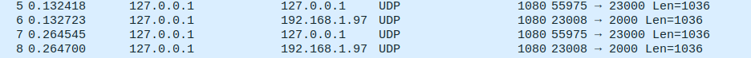
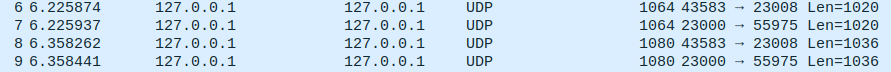

# Call setup based on perl test

Navigate to the project root directory. 

## Connect to rtpengine

First run rtpengine like this:

```
sudo rtpengine --config-file sample-rtpengine.conf
```

The rtpengine will liseten on `127.0.0.1:22222`.

After this make an **offer**: 

```
node lib/offer.js 22222 127.0.0.1 sdps/perl/caller.json
```

Noticable fields in `sdps/perl/caller.json`:

- `ICE:remove` remove any ICE attributes are stripped from the SDP body.
- `label:caller` identify the caller client

Then create an **answer**: 


```
node lib/answer.js 22222 127.0.0.1 sdps/perl/callee.json
```

After this you should send rtpstream by **ffmpeg**: 

```
ffmpeg -re -i audios/recording.wav -ar 8000 -ac 1 -acodec pcm_mulaw -f rtp rtp://127.0.0.1:23000
```

At the port number you should use one of from the response: 

```json
{
  ICE: 'remove',
  'call-id': '0.5423403855684267',
  command: 'offer',
  'from-tag': '0.4166036407436595',
  label: 'caller',
  sdp: 'v=0\r\n' +
    'o=- 1607444729 1 IN IP4 192.168.1.97\r\n' +
    's=tester\r\n' +
    't=0 0\r\n' +
    'm=audio 2000 RTP/AVP 0\r\n' +
    'c=IN IP4 192.168.1.97\r\n' +
    'a=sendrecv\r\n' +
    'a=rtcp:2001'
}
{
  sdp: 'v=0\r\n' +
    'o=- 1607444729 1 IN IP4 192.168.1.97\r\n' +
    's=tester\r\n' +
    't=0 0\r\n' +
    'm=audio 23000 RTP/AVP 0\r\n' +
    'c=IN IP4 127.0.0.1\r\n' +
    'a=rtpmap:0 PCMU/8000\r\n' +
    'a=sendrecv\r\n' +
    'a=rtcp:23001\r\n',
  result: 'ok'
}
```

Use this port: `'m=audio 23000 RTP/AVP 0\r\n' +` and the traffic will appear on port 23008

See the pcaps: 

\
[caller-callee](./caller-callee.pcap)\
\
[callee-caller](./callee-caller.pcap)\